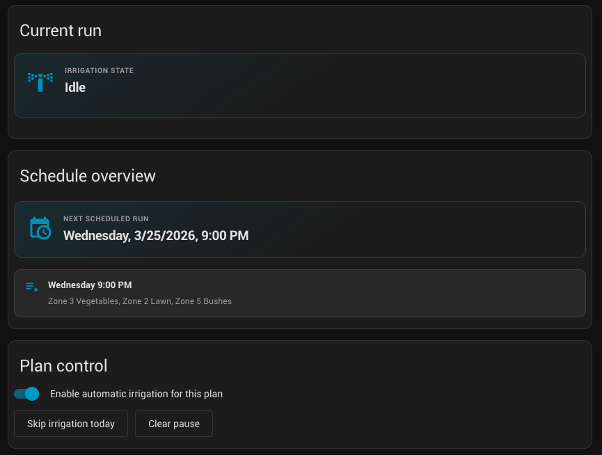
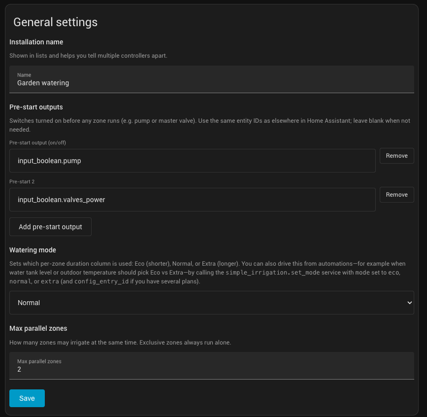
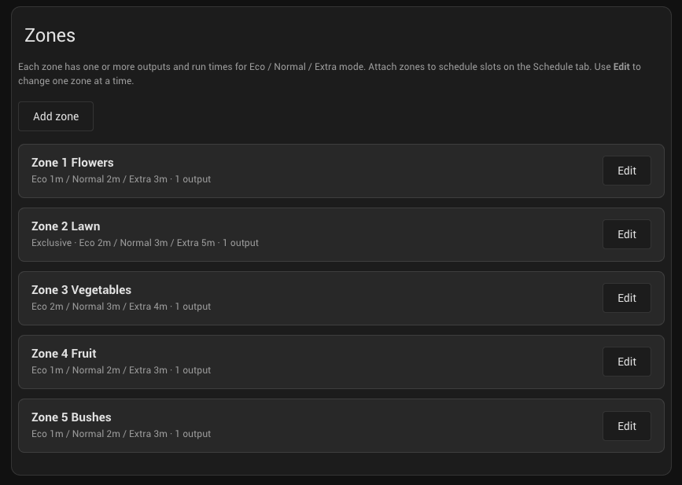
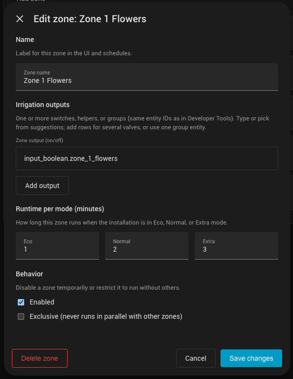
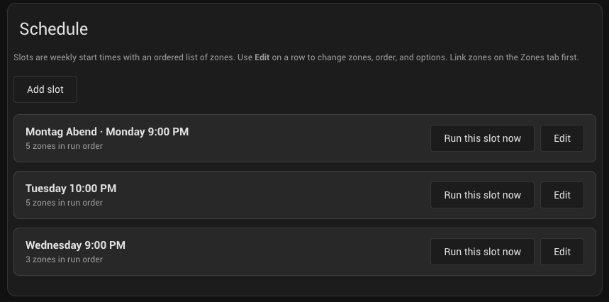
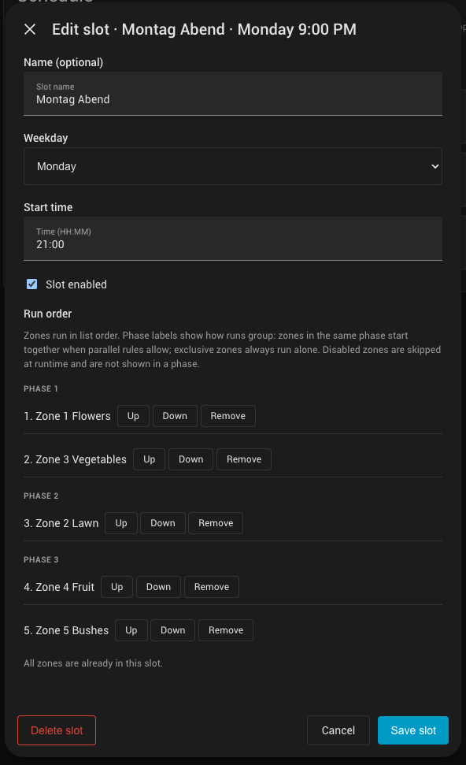
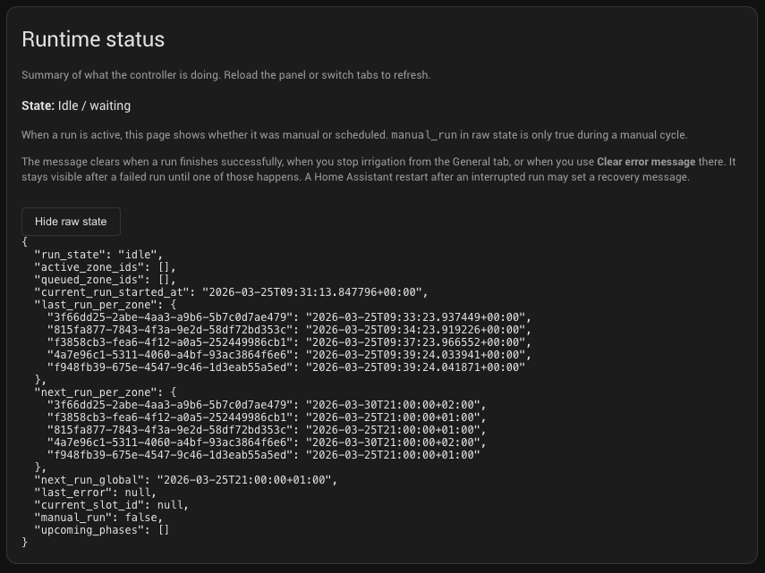

# Simple Irrigation

[](https://github.com/florianbaethge/simple_irrigation/actions/workflows/ci.yml)
[](https://hacs.xyz/docs/faq/custom_repositories/)

**Custom integration for [Home Assistant](https://www.home-assistant.io/)** that orchestrates one irrigation system per config entry: weekly schedule slots, on/off outputs (switches, `input_boolean`, groups), global **Eco / Normal / Extra** watering modes, optional **pre-start** outputs, **parallel** runs with **exclusive** zones, **pause** and **skip today**, and a **sidebar panel** for full configuration (no YAML for zones or schedule).

---

## Overview

| Area | What it does |
|------|----------------|
| **General** | Live run state (preparing / running / stopping), next scheduled run, plan on/off, skip today / clear pause, pre-start entities, mode, max parallel zones, stop / skip phase / clear error |
| **Zones** | Named zones, one or more output entities per zone, Eco/Normal/Extra runtimes (minutes), enabled flag, **exclusive** (never parallel with others) |
| **Schedule** | Weekly slots (weekday + local time), optional slot name, ordered zone list, **phase** preview from parallel rules, “run this slot now” |
| **Status** | Human-readable runtime summary and optional **raw JSON** for debugging |
| **Entities** | Mode select, sensors (next run, active zones, pause, per-zone helpers), binary sensors, buttons — usable in dashboards and automations |
| **Services** | Run zone, run with fixed duration, run due, stop all, set mode, pause until, clear pause |

Languages: **English** and **German** (UI strings, config flow, entities, services, panel). The panel follows the Home Assistant user language when translations are loaded.

**Requirements:** Home Assistant **2024.1** or newer (see `hacs.json`).

---

## Repository layout

```
simple_irrigation/
├── custom_components/simple_irrigation/   # Integration code (Python + built panel)
│   ├── frontend/
│   │   ├── src/                           # Lit/TypeScript panel sources
│   │   └── dist/simple-irrigation-panel.js # Built bundle (commit this for HACS)
│   ├── translations/en.json               # English strings
│   ├── translations/de.json             # German strings
│   ├── strings.json                     # Config flow source strings (English)
│   ├── manifest.json
│   └── …
├── tests/                               # Pytest
├── screenshots/                         # Optional UI screenshots (see screenshots/README.md)
├── .github/workflows/ci.yml             # Tests, panel build, hassfest, HACS validation
├── hacs.json
├── LICENSE
└── README.md
```

---

## Installation

### HACS (custom repository)

1. Open HACS → **Integrations** → **⋮** → **Custom repositories**.
2. Add repository: `https://github.com/florianbaethge/simple_irrigation`, category **Integration**.
3. Install **Simple Irrigation** and restart Home Assistant.
4. **Settings → Devices & services → Add integration** → search **Simple Irrigation**.

### Manual install

Copy the folder `custom_components/simple_irrigation/` into your Home Assistant configuration directory (next to `configuration.yaml`), then restart. Add the integration as above.

---

## First-time setup

1. Complete the **config flow**: installation name, optional pre-start outputs, default mode, max parallel zones.
2. Open the sidebar entry **Simple Irrigation** (admin only).
3. Pick your installation if you have several entries.
4. On **Zones**, add zones and outputs; set durations for Eco / Normal / Extra.
5. On **Schedule**, add slots (weekday + time), then **Edit** each slot to set **run order** and review **phases**.

You can add **multiple** config entries for separate gardens or seasonal plans (each appears in the panel picker).

---

## Customization

- **Watering mode (Eco / Normal / Extra):** Each zone has three duration columns. The active mode chooses which column is used for scheduled and default service runs. Change it in the panel or with the `simple_irrigation.set_mode` service (ideal for automations driven by weather, tank level, etc.).
- **Max parallel zones:** Caps how many zones may run at once. **Exclusive** zones still run alone.
- **Pre-start outputs:** Turned on before zones (e.g. pump / master valve); delay is defined in code (`PRE_START_DELAY_SEC` in `const.py`).
- **Plan off:** Disables automatic starts for that entry; manual runs may still be possible depending on your use of services.
- **Pause / skip today:** Pause respects **scheduled** starts only; an **already running** cycle is stopped from **General** with **Stop irrigation**.

---

## Zones and schedule slots

### Zones

- **Outputs:** Any mix of `switch`, `input_boolean`, and `group` entities that support `turn_on` / `turn_off`.
- **Exclusive:** When checked, that zone never runs in parallel with others (useful for high-flow or shared supply lines).
- **Disabled:** Skipped at runtime and omitted from phase previews where applicable.

### Schedule slots

- Each slot is a **weekday** and **local time** (Home Assistant timezone).
- **Run order** is the ordered list of zone IDs. **Phases** group zones that may start together according to **max parallel** and **exclusive** rules.
- **Edit** a slot to reorder (**Up** / **Down**), **Remove** from list, or **Add zone** from the dropdown.
- **Run this slot now** starts that slot’s sequence immediately (shown as a manual run on **Status**).

Tuning **phases:** Reorder zones or adjust **max parallel** / **exclusive** flags until the phase breakdown matches how you want water to overlap.

---

## Logs and debugging

- **Home Assistant log:** Filter for `simple_irrigation` or set default logging:

  ```yaml
  logger:
    logs:
      custom_components.simple_irrigation: debug
  ```

- **Diagnostics:** **Settings → Devices & services → Simple Irrigation → Download diagnostics** (integration supports diagnostics).
- **Panel:** **Status** tab → **Show raw state (debug)** for the live `run_state` object.

---

## Automations and services

All services accept optional `config_entry_id` when you have more than one Simple Irrigation entry. Find the ID under **Settings → Devices & services → Simple Irrigation → …** (or in diagnostics).

| Service | Typical use |
|---------|-------------|
| `simple_irrigation.run_zone` | Start one zone (scheduled-style duration from current mode) |
| `simple_irrigation.run_zone_with_duration` | Start one zone for N minutes |
| `simple_irrigation.run_due_zones` | Trigger “what’s due now” |
| `simple_irrigation.stop_all` | Stop the active cycle |
| `simple_irrigation.set_mode` | Set `eco` / `normal` / `extra` |
| `simple_irrigation.pause_until` | Pause automatic runs until a datetime |
| `simple_irrigation.clear_pause` | Clear pause |

Example — set mode from an automation:

```yaml
action: simple_irrigation.set_mode
data:
  mode: eco
  # config_entry_id: abc123...  # if multiple entries
```

Use **Developer tools → Services** to explore fields with translated descriptions.

---

## Screenshots

### General





### Zones





### Schedule





### Status



---

## Development

```bash
# Python tests
pip install -r requirements_test.txt
pytest tests/

# Panel (from repo root)
cd custom_components/simple_irrigation/frontend
npm ci
npm run build
```

Commit the updated `frontend/dist/simple-irrigation-panel.js` when you change the panel sources so HACS users do not need Node.

---

## Contributing and support

- **Issues:** [GitHub Issues](https://github.com/florianbaethge/simple_irrigation/issues)
- **License:** [MIT](LICENSE)
